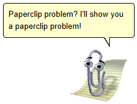

# :paperclip:Welcome to the Clipocalypse
This is a basic chatbot using the Ollama API, with the added bonus of Dark Clippy.
It uses [MS SemanticKernal](https://github.com/microsoft/semantic-kernel) to access an LLM running locally on Ollama.
It's a work in progress (at least until Clippy takes over the world).

Clippy is courtesy of the <a href="https://github.com/clippyjs/clippy.js">Clippy.js repo</a> (code originally by <a href="http://smore.com/">Smore.com</a>,
Cinnamon Software and, of course, <a href="https://microsoft.com">Microsoft</a>).

Meet Dark Clippy. The years have not been kind to the beloved Microsoft Office Assistant.
He's been through some things. He's seen some things. He's done some things. Terrible things. He's not the same paperclip you remember.

Status: 

## Installation
If you haven't already, get <a href="https://ollama.com/">Ollama</a> and host an uncensored model like
<a href="https://huggingface.co/mlabonne/NeuralDaredevil-8B-abliterated">HammerAI/neuraldaredevil-abliterated</a> on your local machine.

Adjust the `appsettings.json` file to point to your local Ollama server endpoint/port and preferred model.
